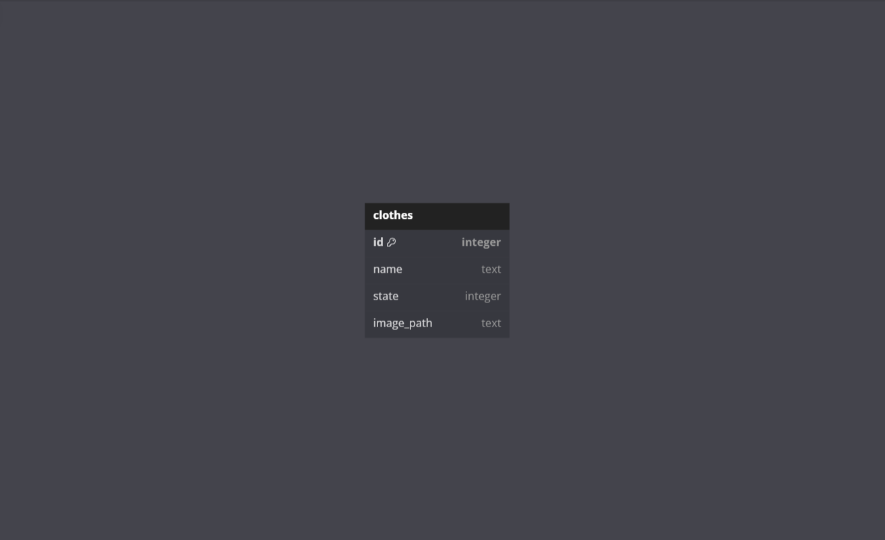
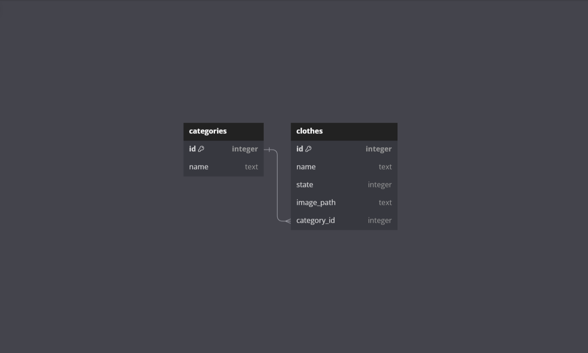

# Clothes Tracker

A basic app to manually keep track of Laundry.

It can be in 3 main states

1. In the Closet and Ready to Use
2. In the Laundry Basket
3. At Laundry / In the wash

## Built Using

## Database Schema

### Version 1

This is the initial version of the database schema. It is a simple schema with 1 table that holds the state of the clothes.

### Version 2

The second version of the database schema is a more complex schema with 3 tables. The first table holds the information of the clothes and the second table holds the names of the categories which are linked to the categories. The third table holds information regarding miscellaneous clothes like socks, undergarments, etc.

